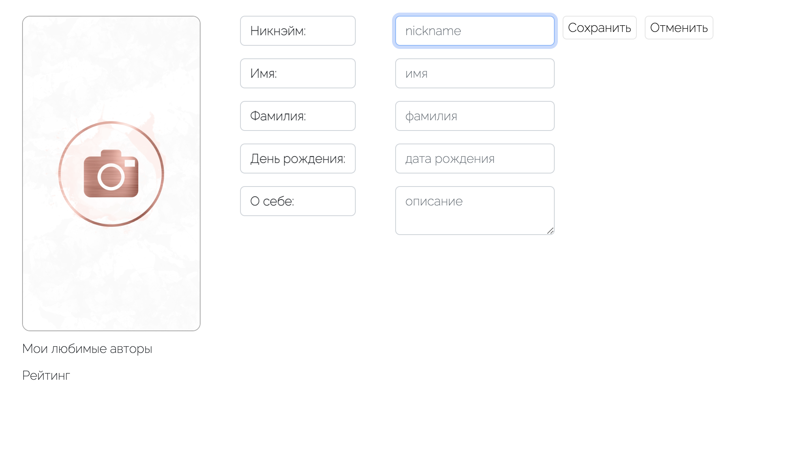

#Проект Профили блога
## Микросервис - Профиль содержит информацию о пользователе, адаптированную для ведения блога

Профиль содержит самую полную информацию о человеке, зарегистрированным в системе

## Визуальная схема фронтенда 

##Описание MVP
Для минимальной реализации полностью готового проекта должно быть реализовано:  
- Описание API системы;
- Докер образ системы;
- Докер-контейнеры с необходимыми приложениями;
- При развертывании система полностью готова к работе и можно подключить по API к любому приложению

##Документация
1. Маркетинг
    1. [Заинтересанты](./docs/01-marketing/01-stakeholders.md)
    2. [Целевая аудитория](./docs/01-marketing/02-target-audience.md)
    3. [Конкурентный анализ](./docs/01-marketing/03-concurrency.md)
    4. [Анализ экономики](./docs/01-marketing/04-economy.md)
    5. [Пользовательские истории](./docs/01-marketing/05-user-stories.md)
2. DevOps
    1. [Схема инфраструктуры](./docs/02-devops/01-infrastructure.md)
    2. [Схема мониторинга](./docs/02-devops/02-monitoring.md)
3. Тесты
4. Архитектура
    1. [Компонентная схема](./docs/03-architecture/01-arch.md)
    2. [Интеграционная схема](./docs/03-architecture/02-integration.md)
    3. [Описание API](./docs/03-architecture/03-api.md)

